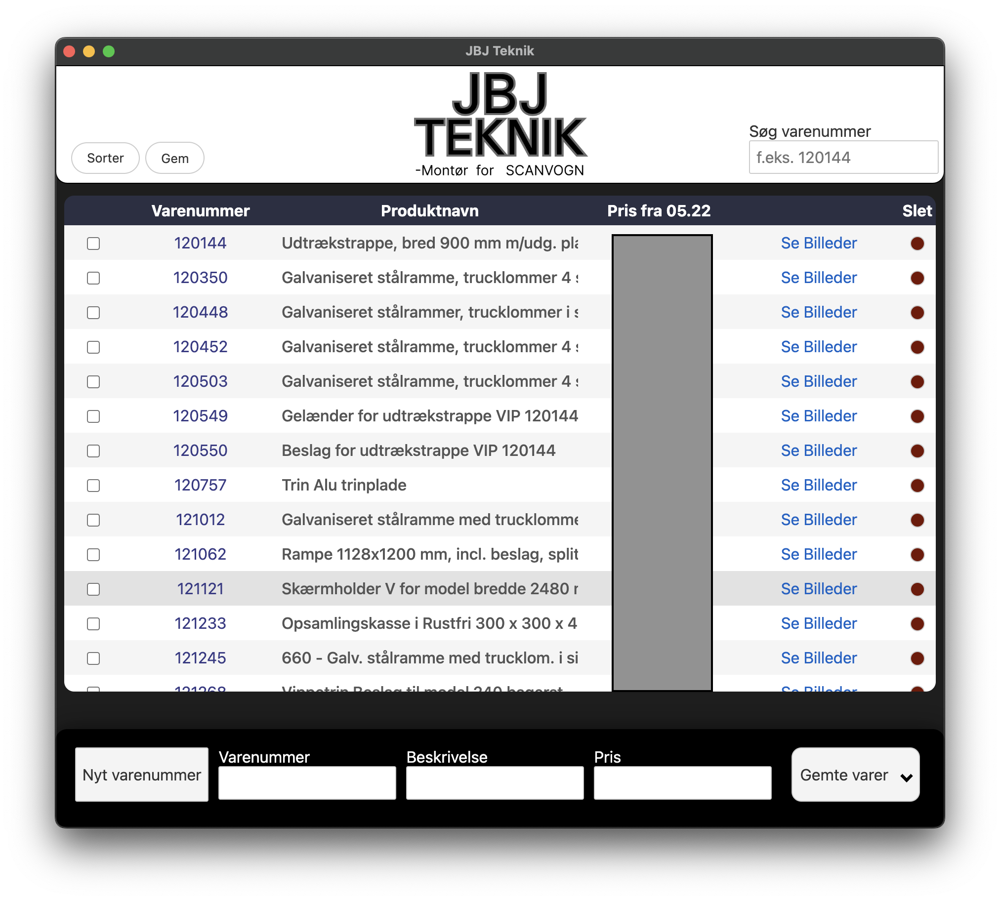
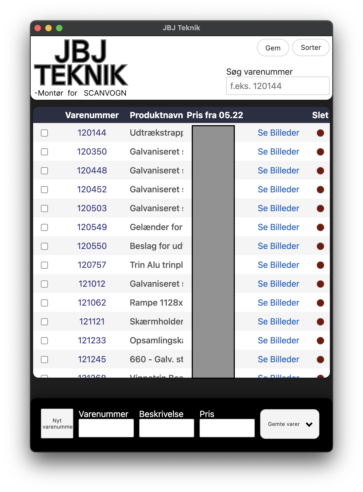

# JBJ Indexer
A simple Electron product overview with search and files.
this was a project i created for JBJTeknik, also my first electron app, of course powered by Svelte, and rollup.

## Setup

in the footer, in the same color as the background, is the app directory path. navigate there, and create a file called "varer.json". node/fs may not have permission to create/edit the file. 
Or it creates the file, but doesn't have permission to edit or save to it. so creating it yourself can fix the fatal error that might appear

## What it looks like

<div>
  
  
</div>

## Build to windows
I took some care to create an actual installer, since it's not intuitive to have to create a shortcut, or navigate the file system and finde the executable.
I use inno scripts and wine + (npm package)inno-compiler to take the output app directory and create an executable.

Building to windows on windows just requires installing inno and running out/packager.iss to create an executable.

### Build from mac/linux
inno is only made to to work from windows to create windows executables...
so install wine. (package manager of your choice)
```
brew install wine@devel
```
Then we make use of inno-compiler on npm.
```
npm install innosetup-compiler
```
then just use the npm scripts, first to build the uncompressed program files:
```
npm run package
```
and then to bundle it.
```
npm run build-release-win
```
## What can it do why was it built?
It has a simple and elegant UI, maybe not the best implemented search bar, a collapsible "saved products" etc. it has room for improvement, but it was essentially built over half a month to aid in writing invoices for products that they provided, and since electron is a chromium browser, it is simple to open files in a new window since chrome supports pdf, image and video previews.
